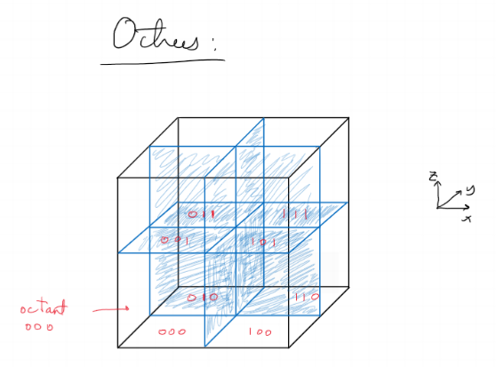
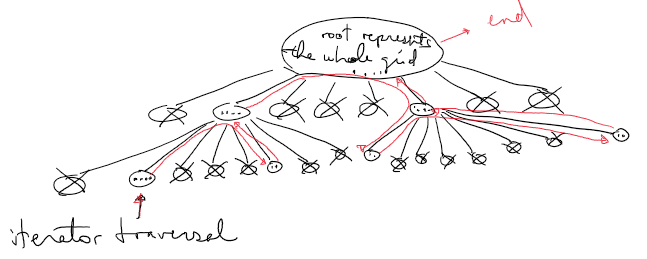

# Simple, Documented, Iterator-friendly Octree Implementation

## Overview

An [octree](https://en.wikipedia.org/wiki/Octree) is a tree data structure in which every node has at most 8 children. An octree subdivides a voxel grid (regular 3d grid) into its 8 octants recursively, that is to say, the root node of the octree encodes the whole voxel grid, and each of its children encodes one octant of its parent's voxel grid. Recursively, every internal node of the octree subdivides its voxel grid into 8 octants encoded in its 8 children.

The following figure shows a voxel grid subdivided into its 8 octants. This voxel grid would correspond to an internal node of an octree, and each of the octants would be children of that internal node. Note that each of those octants can in turn be subdivided into 8 octants again, in which case the previously mentioned children nodes would then become internal nodes themselves and hold at most 8 children nodes. 

Identifying 8 octants of a voxel grid requires only 3 bits of data spanning identifiers [0,1,2,3,4,5,6,7] or in binary [000,001,010,011,100,101,110,111]. Using this fact, we may use those 3-bits to encode information about xyz coordinates. 0 will denote smallest, and 1 greatest. Taking the center of the voxel grid to have coordinates (cx,cy,cz), and a point (x,y,z), we can immediately identify in which octant that point resides by having the identifier xyz = (x > cx, y > cy, z > cz). For example, taking a voxel grid center of (0, 0, 0) and a point (1, -1, 1), we know that the point resides in the octant with identifier xyz = (1 > 0, -1 > 0, 1 > 0) = 101. At any internal node of the octree, we can easily verify which child (octant) possesses the point p. This enables log(N) search time for a specific point. Range searches and k nearest neighbor searches are also logarithmic and the octree is most often used to optimize for those types of queries.



We also provide an octree iterator that is STL-compatible and overload STL algorithms std::find and std::count to take advantage of the octree's structure to accelerate them. Non-modifying STL algorithms are compatible with this octree iterator. 

The octree iterator implements a post-order tree traversal of the octree using a stack of pointers to ancestor nodes to traverse back up the tree when necessary. This saves memory as the octree does not need to have parent node pointers at every node of the tree, and the stack only ever has at most as many elements as the depth of the octree.



Some particularities of this octree implementation are that this octree implementation:
- does not differentiate between leaf nodes and internal nodes explicitly
- holds points at every node of the octree rather than only at leaf nodes
- does not perform node splitting because the points are not only stored in leaf nodes
- uses std::unique_ptr to refer to children nodes for automatic memory management
- encodes every node's voxel grid explicitly as an axis aligned bounding box instead of implicitly defining during traversal down the tree from the root
- does not implement radius search explicitly, as the same result is obtained by performing a range search using a sphere as the queried range

## Dependencies

To run the tests, install [Catch2](https://github.com/catchorg/Catch2).
```
# using vcpkg
$ vcpkg.exe install catch2
```
To run the benchmarks, install [Google Benchmark](https://github.com/google/benchmark)
```
# using vcpkg
$ vcpkg.exe install benchmark
```
To visualize the benchmark results with Python 3
```
$ pip install -r scripts/requirements.txt
```

## Building
Build using [CMake](https://cmake.org/):
```
$ mkdir build
$ cd build
$ cmake .. # -G <generator> -DCMAKE_BUILD_TYPE=Release|Debug -DCMAKE_TOOLCHAIN_FILE=<path to vcpkg>/scripts/buildsystems/vcpkg.cmake
$ cmake --build .
```

## Running
Run tests, benchmarks and visualize benchmark results:
```
# the executables will either be in ./build/Release/ or ./build/ depending on the platform
# we will assume the executables are found in ./build/Release/

# to run the tests
$ ./build/Release/tests.exe

# to run the benchmarks and export them to benchmarks.json
$ ./build/Release/benchmarks --benchmark_format=json --benchmark_out=benchmarks.json

# to plot the benchmark results
$ ./scripts/visualize.py --in ./build/Release/benchmarks.json
```